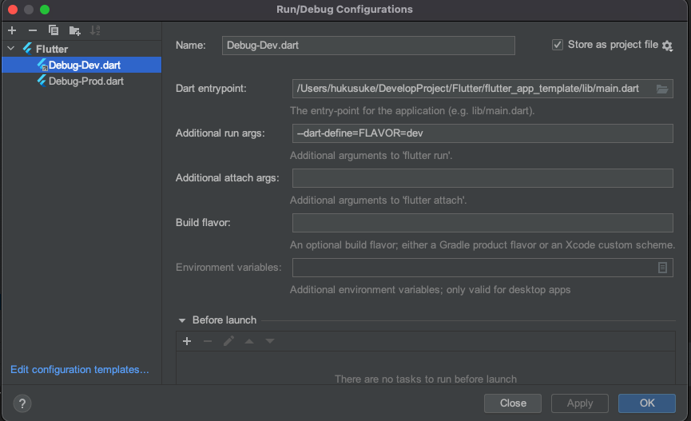

# flutter_app_template

Flutter + Firebase アプリの雛形

ご自由にお使いください。

| カテゴリ      | 説明                          |
| ------------- | ----------------------------- |
| 状態管理と DI | flutter_hooks, hooks_riverpod |
| データモデル  | freezed                       |
| クラウド DB   | cloud_firestore               |
| ローカル DB   | shared_preferences            |

### 環境

Flutter Stable 2.10.0

### 画面構成

- タブ 1
  - SharedPreferences を用いた カウンター
- タブ 2
  - Firestore を用いた カウンター
- タブ 3
  - Firestore を用いた Memo データ一覧と CRUD
- タブ 4
  - アプリバージョンを表示

### 実装済み

- iOS13、Android7 以上で動作
- DDD ライクな設計で構築
- Firebase を利用 (FirebaseAuth, Firestore, Functions, FirebaseAnalytics, FirebaseCrashlytics)
- ボトムナビゲーション構成のサンプル画面
- iOS カメラ、画像のパーミッション許可の plist 設定
- 起動時に匿名認証でログイン
- ダークモード対応
- デバイス向きは縦固定
- 静的解析導入
- その他アプリに必要なライブラリを設定済み
- device_preview 導入
- Android/iOS の Flavor 設定

### やっていないこと

- Android/iOS ローカル通知とプッシュ通知の設定
- Android の keystore の設定（debug, release）
- ローカライズ対応
- iPad 対応
- ユニットテスト
- UI テスト
- dartdoc
- fastlane

## 設計指針

[こちらの資料](https://docs.google.com/presentation/d/19XERQBG-aWWD7R5NEJCyS8VXSeUL9KTENOe0ChYz_1M)にまとめました。

### ディレクトリ構成

- [lib/](./lib)
  - [extensions/](./lib/extensions)
  - [gen/](./lib/gen)
  - [model/](./lib/model)
    - [converters/](./lib/model/converters)
    - [entities/](./lib/model/entities)
    - [exceptions/](./lib/model/exceptions)
    - [repositories/](./lib/model/repositories)
    - [use_cases/](./lib/model/use_cases)
  - [presentation/](./lib/presentation)
    - [pages/](./lib/presentation/pages)
    - [res/](./lib/presentation/res)
    - [widgets/](./lib/presentation/widgets)
  - [main.dart](./lib/main.dart)

### Flavor

| 環境 | パッケージ名        | アプリ名           |
| ---- | ------------------- | ------------------ |
| 開発 | com.example.app.dev | dev.テンプレアプリ |
| 本番 | com.example.app     | 　テンプレアプリ   |

引用: [Flutter で Dart-define のみを使って開発環境と本番環境を分ける](https://zenn.dev/riscait/articles/separating-environments-in-flutter)

#### 実行コマンド

```sh
# 開発
flutter run --debug --dart-define=FLAVOR=dev

# 本番
flutter run --debug --dart-define=FLAVOR=prod
```

Android Studio から実行する場合は以下のように Run Configurations を設定する。




## 新規プロジェクトへの移行方法

1.  git clone で取り込む

    ```
    git clone https://github.com/hukusuke1007/flutter_app_template.git
    ```

2.  取り込んだら .git を削除する

    ```
    rm -rf .git
    ```

3.  `com.example.app` を変更したいパッケージ名 にする

    - パッケージ名を変更する

      - iOS:
        `Xcode > Runner > TARGETS Runner > Build Settings` の `Product Bundle Identifier` を変更。
        Debug, Profile, Release の全てを変更する。但し、`$(APP_ID_SUFFIX)`はそのままにしてください。
        
      - Android:

        - android/app/build.gradle
          - [applicationId](./android/app/build.gradle#L70)
        - AndroidManifest.xml - package

          - [main](./android/app/src/main/AndroidManifest.xml#L2)
          - [debug](./android/app/src/debug/AndroidManifest.xml#L2)
          - [profile](./android/app/src/profile/AndroidManifest.xml#L2)

        - MainActivity.kt
          - [package](./android/app/src/main/kotlin/com/example/app/MainActivity.kt#L1)
        - kotlin 配下のディレクトリ名を変更する

          （例）`com.example.app` から `com.never.jp` へ変更した場合

          ```
            変更前: android/app/src/main/kotlin/com/example/app
            変更後: android/app/src/main/kotlin/com/never/jp
          ```

    - アプリ名を変更する

      - iOS: `$(APP_NAME_PREFIX)`はそのままでそれ以外を変更する
        - [info.plist - CFBundleDisplayName](./ios/Runner/Info.plist#L16)
        - [info.plist - CFBundleName](./ios/Runner/Info.plist#L24)
      - Android: `android/app/build.gradle`
        - [resValue](./android/app/build.gradle#L80)

    - プロジェクト名を変更する

      - `flutter_app_template` のディレクトリ名を変更する

        （例）`flutter_app_template`　から `never_app` へ変更

        ```
          変更前: flutter_app_template/
          変更後: never_app/
        ```

      - [pubspec.yaml の name](./pubspec.yaml#L1)

4.  新しい Firebase プロジェクトを構築する。
    開発環境、本番環境の 2 種類用意する。なお、開発環境のパッケージ名の末尾は必ず `.dev` を付与する。

    - [Firebase の構築方法](https://firebase.flutter.dev/docs/overview)

    構築した Firebase の設定ファイルを以下の場所へ設置する

    - Android

      ```
      # 開発環境
      android/app/src/dev/google-services.json
      # 本番環境
      android/app/src/prod/google-services.json
      ```

    - iOS

      ```
      # 開発環境
      ios/dev/GoogleService-Info.plist
      # 本番環境
      ios/prod/GoogleService-Info.plist
      ```

5.  Firebase コンソールから匿名認証を 開発環境、本番環境共に ON にする

6.  flutter のライブラリを取り込む。 pub get を実行する。
    利用するバージョンを固定にするため、[pubspec.lock](./pubspec.lock) 内のプラグインのバージョンを見て [pubspec.yaml](./pubspec.yaml) のプラグインのバージョンを指定する。

7.  [実行コマンド](#実行コマンド)を用いて動作確認する。

8.  問題なければ新しい git repository を作成して本プロジェクトをプッシュする。

9.  あとは良しなに使わないプラグインやコードを削除して開発を進めてください。

## リリースビルドに関して

- Android

  ```sh
  flutter build appbundle --release --dart-define=FLAVOR=prod
  ```

- iOS
  `ExportOptions.plist` を用意してください。

  [ExportOptions.plist サンプル](./ExportOptions.plist) （teamID は `Apple Developer -> Membership`から確認できます）

  ```sh
  flutter build ipa --export-options-plist=ExportOptions.plist --release --dart-define=FLAVOR=prod
  ```
